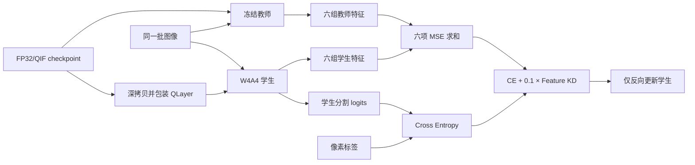

# QAD 训练流程与蒸馏实现说明

本文档说明仓库中现有 QAD（Quantization-Aware Distillation，量化感知蒸馏）的实际实现，并以 UDD 上的历史主实验为复现样例。训练入口是
[`Network/QAT_snn_STE.py`](../Network/QAT_snn_STE.py)，W4A4 量化器是
[`Network/quantization/int4_selfbuild.py`](../Network/quantization/int4_selfbuild.py)。

文档区分两种口径：

- “当前实现”指上述源码现在执行的行为；
- “历史运行”指
  [`SpikingLETNet_shallow_maxbs64gpu1_trainval20260612-135249`](../QAT_checkpoint/udd/SpikingLETNet_shallow_maxbs64gpu1_trainval20260612-135249/log.txt)
  中实际记录的参数和产物。

## 1. 方法概览

QAD 从同一个 FP32/QIF 检查点构造两个网络：

1. 原模型作为冻结教师，不添加 W4A4 假量化；
2. 深拷贝原模型并用 `QLayer` 包装全部可量化层，作为可训练的 W4A4 学生；
3. 教师和学生对同一批图像执行 `forward_qat`，取六组同位置中间特征；
4. 学生同时优化语义分割交叉熵和六组特征的 MSE；
5. 只有学生参数更新，教师始终冻结。



这里没有使用 logits 蒸馏、KL 散度、soft target 或 temperature。教师 logits
虽然在训练代码中被计算并做了时间平均，但没有参与最终损失。

## 2. 历史 UDD 运行配置

下表不是脚本的全部默认值，而是历史主实验 `log.txt` 记录的实际参数。

| 项目 | 历史值 | 说明 |
| --- | --- | --- |
| 模型 | `SpikingLETNet_shallow_max` | 1,303,060 参数 |
| 数据集 | `udd` | 6 类语义分割 |
| 输入尺寸 | `400 × 400` | UDD 分支会覆盖为该尺寸 |
| FP32 起点 | `checkpoint/udd/SpikingLETNet_shallow_maxbs64gpu1_trainval20260611-003821/model_best.pth` | 教师权重，同时也是学生初始化权重 |
| batch size | `64` | 训练 loader 为 `drop_last=True` |
| 每 epoch 迭代数 | `401` | 历史日志记录值 |
| 计划 epoch | `150` | `max_iter = 150 × 401 = 60,150` |
| 实际完成 epoch | `127` | 日志为 epoch `0` 到 `126`；代码本身没有早停逻辑 |
| 优化器 | Adam | `lr=1e-3`，`betas=(0.9, 0.999)`，`eps=1e-8`，`weight_decay=1e-4` |
| 学习率 | polynomial | `power=0.9`，没有使用 warmup |
| 随机种子 | `1234` | PyTorch、CUDA、NumPy 和 Python random |
| 权重/激活位宽 | W4A4 | signed、对称缩放、非对称整数边界 `[-8, 7]` |
| 激活粒度 | `per_tensor` | 每次前向动态计算尺度 |
| 首个量化层 | `0` | 从第一个可量化层开始，共 71 层 |
| KD 权重 | `0.1` | 训练全程固定 |
| CLI 时间长度 `args.T` | `1` | 输入被复制成 `[1, B, C, H, W]` |
| QIF 内部 `T` | `8` | 来自 `1.3M.yaml`，控制 QIF 输出上限 |
| AMP | 未启用 | 训练没有使用 autocast 或 GradScaler |

需要特别注意，当前脚本中 `--max_epochs` 的默认值是 `300`，历史实验通过命令行使用了
`150`。当前脚本的默认 `--checkpoint` 也不是历史主实验的 FP32 起点，因此复现时必须显式指定这两个参数。

## 3. 数据输入与预处理

UDD 数据路径在
[`dataset_builder.py`](../Network/builders/dataset_builder.py) 中按用户名硬编码；`root`
用户对应：

```text
/root/autodl-tmp/UDD/UDD6/preprocessed
```

实际读取：

- 训练：`train_patches.txt`；
- 验证：`val_patches.txt`；
- 训练增强：水平翻转、垂直翻转、90 度随机旋转，各自 `p=0.5`，最后 resize 到
  `400 × 400`；
- 验证预处理：只 resize 到 `400 × 400`；
- 图像先除以 255，再使用 ImageNet mean/std 标准化；mask 保持 class id。

UDD 分支固定使用上述增强，因此日志中的 `random_scale=True`、`random_mirror=True`
不会控制 UDD 的增强。类似地，`train_type=trainval` 不会改变 UDD 分支的输入列表，它仍读取
`train_patches.txt`。

训练 loader 使用 `shuffle=True`、`pin_memory=True`、`drop_last=True`；验证 loader
使用 batch size 20、`shuffle=False`，且保留最后一个不满 batch。

## 4. 教师和学生的构造

### 4.1 教师

训练首先构建 `SpikingLETNet_shallow_max`，加载配置
[`1.3M.yaml`](../Network/configs/SpikingLETNet_shallow/1.3M.yaml)，再加载 FP32
checkpoint 的 `checkpoint['model']`。随后：

- 设置 SpikingJelly 多步模式 `step_mode='m'`；
- 所有参数设置为 `requires_grad=False`；
- 模型设置为 `eval()`；
- 教师前向包在 `torch.no_grad()` 中。

这里的“FP32 教师”准确含义是：教师没有 W4A4 `QLayer`，卷积/线性层使用 FP32
权重和输入。它仍保留网络本身的 QIF 神经元，并非普通 ReLU ANN。QIF 会执行
`round(clamp(v, 0, 8))`，因此教师中间激活本身仍具有整数化的 QIF 语义。

### 4.2 学生

`quantize_model(..., inplace=False)` 会先深拷贝已加载教师权重的模型，然后递归替换以下层：

- `Conv2d`；
- `Linear`；
- `ConvTranspose2d`。

默认模型共识别出 71 个可量化层。历史配置 `quant_start_layer=0`，所以 71 层全部包装为
`QLayer`。BatchNorm、池化、QIF、插值、attention 和逐元素运算不由 `QLayer` 包装。

每个 `QLayer` 内部保留一份可训练的 FP32 master weight。前向时临时生成假量化权重，反向时
通过 STE 把梯度传回 master weight。学生不是预先离线量化后再微调，而是在每次训练前向中重新
执行 fake quantization。

## 5. W4A4 假量化细节

### 5.1 权重量化

对每一层权重 `W`，4 bit 时 `quant_range = 2^(4-1) = 8`：

\[
s_w = \max\left(10^{-5}, \frac{\max |W|}{8}\right)
\]

\[
\hat{W} = s_w \cdot \operatorname{clip}
\left(\operatorname{round}\left(\frac{W}{s_w}\right), -8, 7\right)
\]

代码用下式实现 STE：

```python
weight_q = weight + (weight_q - weight).detach()
```

其结果是前向使用 `weight_q`，反向近似为对 FP32 `weight` 的恒等梯度。权重尺度是每层
per-tensor、每次前向重新计算、不可学习的动态尺度。bias 不做 4 bit 量化。

### 5.2 激活量化

历史运行使用 `per_tensor`，普通路径与权重采用相同形式：

\[
s_x = \max\left(10^{-5}, \frac{\max |x|}{8}\right), \qquad
\hat{x} = s_x \cdot \operatorname{clip}
\left(\operatorname{round}\left(\frac{x}{s_x}\right), -8, 7\right)
\]

尺度从 `x.detach()` 计算，舍入和截断同样使用 STE。源码还支持 `per_image` 和
`per_channel`，但它们不属于该历史运行。

### 5.3 历史整数旁路

激活量化前会检查整个输入 tensor：若所有元素已经是整数，且全部落在 `[-8, 8]`，则直接返回
原 tensor 并令 `scale_x=1`。因此存在两种边界：

- 普通激活量化路径：`[-8, 7]`；
- 整数旁路：允许 `[-8, 8]`，所以 QIF 产生的 `+8` 可以保留。

这不是标准 signed int4 的严格 `[-8, 7]` 行为，而是历史 QAD 实现的一部分。已有完整验证审计
记录到 QAD 共触发 22,045 次整数旁路，其中 5,188 次包含 `+8`。复现实验时不应在不披露的
情况下修正该行为。

### 5.4 计算载体

W4A4 表示训练前向模拟的量化精度。`QLayer` 会把量化码乘回浮点尺度，再调用 PyTorch
`conv2d`、`linear` 或 `conv_transpose2d`；训练并没有调用真实 INT4 kernel，也没有在训练中
冻结校准 scale 或导出部署整数图。

## 6. 时序与 QIF 语义

代码中有两个容易混淆的 `T`：

1. `args.T` 来自训练命令，决定原图复制多少次，即输入形状
   `[args.T, B, C, H, W]`；历史运行中它是 `1`。
2. 模型配置 `model.T` 来自 YAML，递归写入每个 `QIFNode.T`；历史配置中它是 `8`，被用作
   QIF 量化函数的上界 `alpha`。

因此历史训练并不是执行 8 个输入时间步。实际输入时间维长度是 1，而 QIF 节点可以输出
`0, 1, ..., 8` 的整数值。训练和验证都会对 5D logits 的第一维做时间平均；当 `args.T=1` 时该平均不改变
数值。中间特征只在满足 `temporal_average` 的维数条件时平均，具体见下一节。

每个 batch 结束后，教师和学生都会调用 `functional.reset_net(...)`，清空 QIF 的膜电位等
有状态变量，防止状态跨 batch 泄漏。

## 7. 六点特征蒸馏

默认模型的
[`forward_qat`](../Network/model/SpikingLETNet_shallow_max.py#L402) 同时返回分割输出和
六个中间特征：

| 序号 | 源码变量 | 网络位置 | 400×400 输入下的返回形状 |
| --- | --- | --- | --- |
| 1 | `output1` | Encoder DAB Block 1 | `[T, B, 128, 100, 100]` |
| 2 | `output2` | Encoder DAB Block 2 | `[T, B, 128, 50, 50]` |
| 3 | `output3` | Encoder DAB Block 3、进入 transformer 前 | `[B, 64, 25, 25]` |
| 4 | `output4` | Decoder DAB Block 4 + upsample 1 | `[T, B, 32, 50, 50]` |
| 5 | `output5` | Decoder DAB Block 5 + upsample 2 | `[T, B, 32, 100, 100]` |
| 6 | `output6` | Decoder DAB Block 6 + upsample 3 + final conv | `[T×B, 32, 200, 200]` |

`output3` 在模型内部已经执行 `mean(0)`，所以返回时没有时间维。`output6` 在插值生成 logits
之前执行了 `flatten(0, 1)`，把 `T` 与 `B` 合并，因此返回时也不是 5D。只有
`output1`、`output2`、`output4` 和 `output5` 会由训练函数再执行一次 `mean(0)`。历史运行
`T=1`，所以 `output6` 的展平等价于去掉长度为 1 的时间维；若改为 `T>1`，第六项 MSE 会把
时间步视作扩展后的 batch，而不是先做时间平均。教师和学生结构相同，不需要额外的
projection、adapter 或通道对齐层。

对时间对齐后的第 `i` 对特征，使用默认 `nn.MSELoss(reduction='mean')`：

\[
L_i = \operatorname{mean}\left((F_i^S - \operatorname{stopgrad}(F_i^T))^2\right)
\]

六项直接求和，不再除以 6：

\[
L_{\text{feature-KD}} = \sum_{i=1}^{6} L_i
\]

由于每一项先独立求均值，六个尺度在标量求和时权重相同，不会因为某层像素数更多而自动获得更大
权重。教师特征显式 `detach()`，且教师前向本身位于 `no_grad()` 中。

## 8. 总损失与梯度流

UDD 不进入 class-weight、OHEM、Lovasz、label smoothing 等特殊分支，历史运行也没有启用
Focal Loss，因此任务损失是未加类别权重的像素交叉熵：

\[
L_{\text{task}} = \operatorname{CrossEntropy}(z^S, y)
\]

其中学生 logits 先对时间维求均值。最终损失为：

\[
\boxed{
L_{\text{QAD}} = L_{\text{task}} + 0.1 L_{\text{feature-KD}}
}
\]

`0.1` 在整个训练中固定，不做 warmup 或随 epoch 衰减。反向传播关系如下：

- 任务损失更新学生；
- 特征 MSE 更新学生；
- fake quantization 通过 STE 更新学生的 FP32 master weights；
- 教师不接收梯度，也不是学生参数的 EMA；
- 教师 logits 不参与任何损失。

日志中的 `loss` 和每个 epoch 的 `Loss(Tr)` 都是上述总损失，不是单独的任务损失。训练控制台会
另外打印 `task_loss` 和未乘 `kd_weight` 的原始 `kd_loss`。

## 9. 单个训练迭代的执行顺序

每个 iteration 严格按以下顺序运行：

1. 根据 `epoch` 和 `iteration` 计算全局 `cur_iter`；
2. 更新当前 polynomial learning rate；
3. 将图像和标签移到 GPU，并把图像复制为 `[T, B, C, H, W]`；
4. 教师在 `eval + no_grad` 下执行 `forward_qat`；
5. 学生在 `train` 下执行 `forward_qat`；
6. 对 logits 做时间平均，并按第 7 节的维数规则处理中间特征；
7. 计算六项 MSE 之和、学生交叉熵和总损失；
8. `optimizer.zero_grad()`、`loss.backward()`、`optimizer.step()`；
9. 调用 scheduler step；
10. reset 教师和学生的神经元状态。

历史运行使用的学习率可写为：

\[
\operatorname{lr}(e,j) = 10^{-3}
\left(1 - \frac{401e+j}{60150}\right)^{0.9}
\]

其中 `e` 是从 0 开始的 epoch，`j ∈ [0, 400]`。`warmup_iters=500` 和
`warmup_factor=1/3` 虽然出现在参数记录中，但 `lr_schedule='poly'`，所以没有进入
`warmpoly` 分支。

## 10. 验证、最佳模型和 checkpoint

当前实现每个 epoch 都在完整验证 loader 上评估学生：

1. 学生切换到 `eval()`；
2. 使用普通 `model(input)`，而不是 `forward_qat`；
3. 对输出做时间平均；
4. 用 6×6 混淆矩阵累计全部像素；
5. 计算 6 个类别（包含 background）的 IoU，并取算术平均得到 mIoU；
6. 每个验证 batch 后 reset 学生状态。

若当前 `mIoU >=` 本次进程此前最佳值，会保存三种产物：

| 文件 | 内容 | 推荐用途 |
| --- | --- | --- |
| `model_q_best.pth` | `QLayer` 学生的完整 state dict | 重建 QAD 学生、继续执行 W4A4 fake-quant 前向 |
| `model_best.pth` | 从 `QLayer.layer` 导出的 FP32 master weights，键名恢复为原模型格式 | 加载到未包装原模型；它本身不包含 W4A4 前向语义 |
| `model_q_best_complete.pt` | pickle 的完整学生模块对象 | 临时加载；对源码路径和 Python 环境更敏感 |

前两类字典只有 `epoch` 和 `model` 两个顶层字段；`epoch` 保存为当前零基 epoch 加 1。

历史主运行的日志共完成 127 个 epoch。日志内最高验证 mIoU 是 `0.6175`，出现在零基 epoch
`118`；对应 `model_q_best.pth` 的 `epoch` 字段为 `119`。后续统一评估脚本在完整 8,478 样本
验证集上重算该 checkpoint，得到 mIoU `0.619547317`。这两个数分别属于训练期日志和后续统一
重评结果，不应混写成同一评估记录。

## 11. 历史配置复现命令

从仓库根目录运行：

```bash
python Network/QAT_snn_STE.py \
  --model SpikingLETNet_shallow_max \
  --dataset udd \
  --config Network/configs/SpikingLETNet_shallow/1.3M.yaml \
  --checkpoint checkpoint/udd/SpikingLETNet_shallow_maxbs64gpu1_trainval20260611-003821/model_best.pth \
  --input_size 400,400 \
  --max_epochs 150 \
  --batch_size 64 \
  --num_workers 6 \
  --lr 0.001 \
  --optim adam \
  --lr_schedule poly \
  --poly_exp 0.9 \
  --quant_bits 4 \
  --activation_quant_mode per_tensor \
  --quant_start_layer 0 \
  --kd_weight 0.1 \
  --T 1 \
  --gpus 0
```

命令目标是复现历史配置，不保证产生逐 bit 相同结果：历史运行只执行了 seed 1234，且 checkpoint
不保存全部可复现状态。输出目录会在 `QAT_checkpoint/udd/` 下自动追加模型、batch size、GPU 数、
训练类型和时间戳。

## 12. 恢复训练限制

当前 `--resume` 不是严格意义上的完整断点恢复：

- checkpoint 不保存 optimizer state，因此 Adam 的一阶、二阶动量会丢失；
- 不保存 scheduler state；学习率会按 `start_epoch` 重新计算，但优化器历史不会恢复；
- 不保存随机数生成器状态、DataLoader sampler 状态或 batch 内位置；
- 不保存历史最佳 mIoU，恢复后的最佳值只在新进程的验证列表中比较；
- 保存目录在读取 resume 前已经按当前时间新建，因此恢复会写入新目录；
- 从 `model_q_best.pth` 恢复可直接加载 `QLayer` 学生；
- 若用导出的 `model_best.pth` 恢复，`model_q.load_state_dict` 会失败并进入 fallback。fallback 会先把
  该 FP32 master state 加载到 `model`，再重新量化；这也会覆盖原本从 `--checkpoint` 加载的教师，
  从而改变蒸馏教师。

因此，需要继续 QAD 训练时应优先使用 `model_q_best.pth`，同时明确记录“Adam 状态已重置”；若要求
完全可复现的断点续训，需先扩展 checkpoint 格式，保存 optimizer、scheduler、最佳指标和 RNG
状态。

## 13. 实现口径与常见误读

1. **QAD 不等于单纯 QAT。** 当前总损失含六点 feature KD；移除教师和 MSE 才是仓库对比实验中的
   STE-QAT 消融。
2. **教师不是 ReLU ANN。** 它是未加 W4A4 包装的 FP32-weight QIF 网络。
3. **历史运行不是 8 个输入时间步。** `args.T=1`；YAML 中的 8 用于 QIF 输出范围。
4. **“W4A4”是 fake quantization。** 训练计算仍由浮点 PyTorch kernel 执行。
5. **激活边界不总是 `[-8, 7]`。** 整数旁路允许 `+8`。
6. **训练计划 150 epoch，实际只有 127 epoch。** 源码没有早停，不能把日志终止解释成算法自动收敛
   停止。
7. **最佳模型由验证集选择。** 后续统一结果又在同一验证总体上评估，不能视作独立测试集性能。
8. **Argparse 的布尔参数有陷阱。** `activation_quant` 等参数使用 `type=bool`，字符串
   `"False"` 仍可能被解析为真；历史配置保持默认开启，复现时不要用字符串方式尝试关闭。

## 14. 关键源码索引

- 参数、模型构造、训练主循环、损失、验证与保存：
  [`Network/QAT_snn_STE.py`](../Network/QAT_snn_STE.py)
- W4A4 `QLayer`、STE、整数旁路和递归包装：
  [`Network/quantization/int4_selfbuild.py`](../Network/quantization/int4_selfbuild.py)
- 默认网络与六个 `mid_outputs`：
  [`Network/model/SpikingLETNet_shallow_max.py`](../Network/model/SpikingLETNet_shallow_max.py)
- QIF 的整数化、反向和状态行为：
  [`Network/model/module/neuron.py`](../Network/model/module/neuron.py)
- UDD loader 和增强：
  [`Network/builders/dataset_builder.py`](../Network/builders/dataset_builder.py)、
  [`Network/dataset/udd.py`](../Network/dataset/udd.py)
- 历史运行日志：
  [`QAT_checkpoint/.../20260612-135249/log.txt`](../QAT_checkpoint/udd/SpikingLETNet_shallow_maxbs64gpu1_trainval20260612-135249/log.txt)
- 后续统一评估结果：
  [`quantization_comparison_results/seed1234/comparison.json`](../quantization_comparison_results/seed1234/comparison.json)

